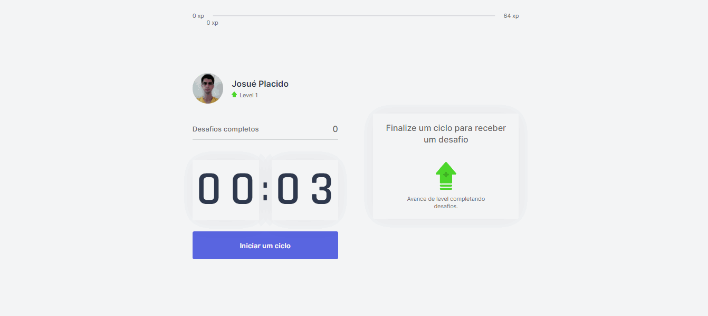

<h1 align="center"></h1>

<p align="center">Projeto desenvolvido na semana Next Level Week 4.0 da Rocketseat.</p>

<p align="center">
  <a href="#sobre-o-projeto">Sobre o projeto</a> &#x2022;
  <a href="#requisitos">Requisitos</a> &#x2022;
  <a href="#tecnologias">Tecnologias</a> &#x2022;
  <a href="#como-executar-o-projeto">Como executar o projeto</a> &#x2022;
  <a href="#licença">Licença</a>
</p>



<h2 id="sobre-o-projeto">Sobre o projeto</h2>

A ideia do _move.it_ é ajudar pessoas que ficam muito tempo na frente do computador e se esquecem de movimentar-se. Por isso o nome move.it.

<h2 id="requisitos">Requisitos</h2>

-   <a href="https://nodejs.org">Node.js</a>
-   <a href="https://classic.yarnpkg.com">Yarn</a> (Opcional)

<h2 id="tecnologias">Tecnologias</h2>

-   [TypeScript][typescript]
-   [React][reactjs]
-   [NextJS][nextjs]

    ... 🚧 em construção 🚧...

<h2 id="como-executar-o-projeto">Como executar o projeto</h2>

-   Para clonar execute esse comando no seu terminal

    ```bash
    git clone https://github.com/josueplacido/nlw-04.git
    ```

-   Acesse a pasta **NLW-04** pelo o terminal

    ```bash
    cd NLW-04/projects/frontend
    ```

-   Faça a instalação das dependências do projeto

    ```bash
    # Com yarn
    yarn

    # Com npm
    npm install
    ```

-   Para iniciar a aplicação

    ```bash
    # Com yarn
    yarn start

    # Com npm
    npm run start
    ```

<p align="center">

  

  <a href="https://github.com/josueplacido/nlw-04/commits/master">
    
  </a>

  

  

  

   <a href="https://www.linkedin.com/in/gabriel-pereira-oliveira-78b1801ab/">
    
  </a>

  <a href="https://github.com/JosuePlacido/nlw-04/commits/master">
    
  </a>

  

  

  
   <a href="https://github.com/JosuePlacido/nlw-04/stargazers">
    
  </a>
</p>

## Conceitos e padrões

Lista de conceitos, padrões, técnicas e metodologias estudada e/ou aplicada no projeto.

-   MONOREPO

---

## Autor

<a alt="Linkedin" href="https://linkedin/in/josueplacido">
 
 <br />
 <sub><b>Josué Placido</b></sub></a>

Feito com ❤️ por Josué Placido 👋🏽 Entre em contato!

[](https://www.linkedin.com/in/josueplacido/)
[](mailto:juplacido.jnr@gmail.com)
[](mailto:ozzyplacidojunior@hotmail.com)

## Licença

Este projeto esta sobe a licença [MIT](./LICENSE).

[expo]: https://expo.io/
[image-picker]: https://docs.expo.io/versions/latest/sdk/imagepicker/
[handlebars]: https://handlebarsjs.com/
[postgres]: https://www.postgresql.org/
[typeorm]: https://typeorm.io/#/
[nodejs]: https://nodejs.org/en/
[redis]: https://redis.io/
[typescript]: https://www.typescriptlang.org/
[reactjs]: https://reactjs.org
[reactnative]: https://reactnative.dev/
[rs]: https://rocketseat.com.br
[rocketseat]: https://github.com/Rocketseat
[nextjs]: https://nextjs.org/
